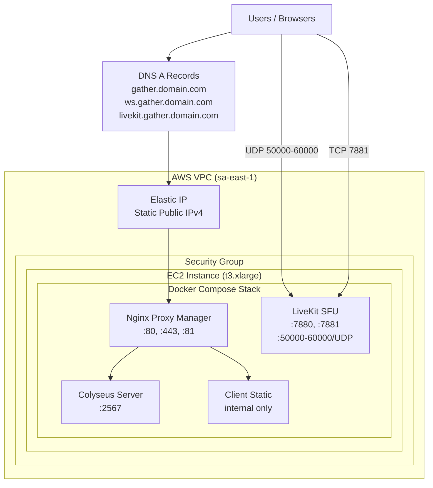
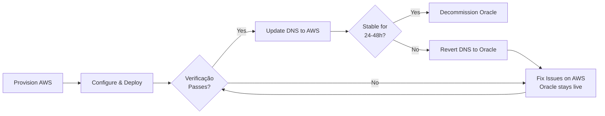

# Design Document: AWS Deployment Migration

## Overview

This feature adds a comprehensive AWS deployment section to the existing `docs/DEPLOY.md` guide, enabling platform operators to migrate the 7Gather platform from Oracle Cloud Free Tier to Amazon Web Services (AWS). The deliverable is documentation — no application code, Dockerfiles, or docker-compose.yml changes are required.

The migration is motivated by Oracle Cloud's inability to provision new compute instances in the operator's region. The AWS deployment replicates the identical Docker Compose architecture (Nginx Proxy Manager, Colyseus, LiveKit, static client) on an EC2 instance, targeting the same capacity of 5 rooms × 20 participants (100 concurrent users) with audio-only mode.

### Design Goals

- Provide a self-contained AWS deployment guide as a new section in the existing DEPLOY.md
- Maintain consistency with the existing documentation style (Portuguese language, step-by-step format)
- Document all AWS-specific differences from the Oracle Cloud deployment
- Ensure operators can execute the migration without downtime via parallel deployment strategy
- Keep the same Docker Compose stack with zero code modifications

### Key Design Decision: Documentation Structure

The new AWS section will be inserted into `docs/DEPLOY.md` as **"Opção 4: AWS EC2"** following the existing pattern of numbered cloud provider options (Oracle Cloud, Fly.io, Railway). This preserves the document's established structure while adding AWS as a first-class deployment target. A separate migration-specific subsection will handle the Oracle → AWS transition.

---

## Architecture

### Deployment Architecture on AWS

The AWS deployment uses a single EC2 instance running the full Docker Compose stack, identical to the Oracle Cloud approach. The key architectural difference is the network layer: AWS Security Groups replace Oracle's dual iptables + Security Lists mechanism.



### Instance Type Selection

| Instance Type | vCPUs | RAM | Network | Cost (sa-east-1) | Use Case |
|---------------|-------|-----|---------|-------------------|----------|
| t3.medium | 2 | 4 GB | Up to 5 Gbps | ~$42/mo | Minimum viable |
| **t3.xlarge** | **4** | **16 GB** | **Up to 5 Gbps** | **~$85/mo** | **Recommended** |
| t3.large | 2 | 8 GB | Up to 5 Gbps | ~$60/mo | Budget alternative |

The recommended instance (t3.xlarge) provides 4 vCPUs and 16 GB RAM, exceeding the 4 vCPU / 8 GB minimum for 5 rooms with 20 audio-only participants. The extra headroom accommodates occasional video usage and OS overhead.

### Architecture Differences: Oracle Cloud vs AWS

| Aspect | Oracle Cloud | AWS |
|--------|-------------|-----|
| Architecture | ARM (Ampere A1) | x86_64 |
| Firewall | iptables + Security Lists (dual layer) | Security Groups only (stateful) |
| IP Assignment | VCN Public IP (may change on stop) | Elastic IP (persists across stop/start) |
| Port Config | Security List + iptables rules | Security Group inbound rules only |
| Cost | Always Free (4 OCPU / 24 GB) | Paid (~$85/mo for t3.xlarge) |
| Docker images | ARM builds | x86_64 builds (default) |

---

## Components and Interfaces

### Document Structure

The design affects a single file: `docs/DEPLOY.md`. The new content will be organized as follows:

```
docs/DEPLOY.md (modified)
├── [existing] Requisitos Mínimos de Infraestrutura
├── [existing] Opção 1: Oracle Cloud Free Tier (Recomendado)
├── [existing] Opção 2: Fly.io
├── [existing] Opção 3: Railway
├── [NEW] Opção 4: AWS EC2
│   ├── Passo 1: Criar conta AWS e configurar IAM
│   ├── Passo 2: Criar instância EC2
│   ├── Passo 3: Configurar Security Group
│   ├── Passo 4: Alocar Elastic IP
│   ├── Passo 5: Instalar Docker e Docker Compose
│   ├── Passo 6: Configurar LiveKit para produção AWS
│   ├── Passo 7: Deploy da aplicação
│   ├── Passo 8: Configurar Nginx Proxy Manager
│   ├── Passo 9: Configurar DNS
│   ├── Estimativa de Custos
│   └── Segurança e Boas Práticas
├── [NEW] Migração Oracle Cloud → AWS
│   ├── Tabela Comparativa
│   ├── Sequência de Migração
│   └── Rollback
├── [existing] Configuração de Domínio Público
├── [existing] Configuração Let's Encrypt (SSL/TLS)
├── [existing] Troubleshooting SSL
├── [existing] Verificação Pós-Deploy
└── [existing] Resumo de Custos (updated with AWS row)
```

### Component Interactions

Since the deliverable is documentation, "components" here refer to the sections of the guide and how they reference each other:

1. **AWS EC2 Section** — Self-contained deployment guide, references shared sections (DNS, SSL, Verificação Pós-Deploy)
2. **Migration Section** — References both Oracle Cloud section and AWS section for comparison
3. **Resumo de Custos** — Updated table with AWS cost row
4. **Security Group Table** — Central reference for all required network rules
5. **LiveKit Config Section** — References `config/livekit.yaml` and `docker-compose.yml` port mappings

### Files Referenced by the Guide

| File | Modification | Description |
|------|-------------|-------------|
| `docs/DEPLOY.md` | **Modified** | Primary deliverable — new AWS section added |
| `config/livekit.yaml` | Referenced (not modified) | Guide documents production values to set |
| `docker-compose.yml` | Referenced (not modified) | Guide documents port range change for production |
| `.env.example` | Referenced (not modified) | Guide documents production .env values |

---

## Data Models

This feature does not introduce new data models. The infrastructure configuration can be modeled as:

### Security Group Rule Model

```
SecurityGroupRule {
  direction: "inbound" | "outbound"
  protocol: "TCP" | "UDP" | "All"
  port_range: string          // e.g., "80", "50000-60000"
  source: string              // e.g., "0.0.0.0/0" or "<operator_ip>/32"
  description: string
}
```

### Complete Security Group Configuration

| Direction | Port | Protocol | Source | Description |
|-----------|------|----------|--------|-------------|
| Inbound | 22 | TCP | `<operator_ip>/32` | SSH (restricted) |
| Inbound | 80 | TCP | 0.0.0.0/0 | HTTP (redirect to HTTPS) |
| Inbound | 81 | TCP | `<operator_ip>/32` | Nginx Proxy Manager admin (restricted) |
| Inbound | 443 | TCP | 0.0.0.0/0 | HTTPS |
| Inbound | 7881 | TCP | 0.0.0.0/0 | LiveKit TCP signaling |
| Inbound | 50000-60000 | UDP | 0.0.0.0/0 | WebRTC media (LiveKit) |
| Inbound | 5349 | TCP | 0.0.0.0/0 | TURN TLS (when enabled) |
| Inbound | 3478 | UDP | 0.0.0.0/0 | TURN UDP (when enabled) |
| Outbound | All | All | 0.0.0.0/0 | All outbound traffic |

### LiveKit Production Configuration Model

```yaml
# config/livekit.yaml — production values for AWS
port: 7880

rtc:
  port_range_start: 50000
  port_range_end: 60000
  use_external_ip: true
  tcp_port: 7881
  # node_ip: removed (auto-detect via EC2 metadata)

turn:
  enabled: true
  domain: livekit.gather.seudominio.com
  tls_port: 5349
  udp_port: 3478
```

### Docker Compose Port Mapping Change

```yaml
# Development (current):
ports:
  - "7882-7932:7882-7932/udp"

# Production AWS (documented in guide):
ports:
  - "50000-60000:50000-60000/udp"
```

### DNS Records Model

| Type | Name | Value | TTL |
|------|------|-------|-----|
| A | `gather.seudominio.com` | `<Elastic_IP>` | 300 |
| A | `ws.gather.seudominio.com` | `<Elastic_IP>` | 300 |
| A | `livekit.gather.seudominio.com` | `<Elastic_IP>` | 300 |

---

## Correctness Properties

*A property is a characteristic or behavior that should hold true across all valid executions of a system — essentially, a formal statement about what the system should do. Properties serve as the bridge between human-readable specifications and machine-verifiable correctness guarantees.*

**Not applicable to this feature.** The deliverable is a documentation file (`docs/DEPLOY.md`), not executable code with functions, algorithms, or data transformations. There are no universally quantified properties to test — no inputs to vary, no outputs to verify across iterations, and no pure functions to exercise. Verification is performed through manual review and the embedded post-deploy checklist.

---

## Error Handling

Since this is a documentation deliverable, "error handling" refers to the troubleshooting guidance and rollback procedures documented in the guide.

### Deployment Failure Scenarios

| Scenario | Detection | Documented Resolution |
|----------|-----------|----------------------|
| Container exits/restarts within 60s | `docker compose ps` shows "restarting" | Check port conflicts, memory, Docker daemon status |
| LiveKit media not flowing | UDP connectivity probe fails | Verify Security Group UDP 50000-60000 rule; check `use_external_ip: true` |
| SSL certificate not provisioned | HTTPS returns error | Verify DNS propagation, port 80 accessible, rate limits |
| WebSocket upgrade fails | HTTP 101 not returned | Check Nginx Proxy Manager WebSocket support enabled |
| SSH access lost | Connection timeout | Verify Security Group port 22 rule, correct Key Pair |
| DNS not propagating after 48h | `dig` returns old/no IP | Verify A record at provider, check for conflicting records |

### Rollback Strategy

The migration guide documents a zero-downtime approach:

1. **Pre-cutover**: AWS instance is fully provisioned and verified using the Elastic IP directly
2. **Verification gate**: Entire post-deploy checklist must pass against AWS IP before DNS change
3. **DNS cutover**: Only update DNS after AWS passes all checks
4. **Rollback**: If issues found post-DNS-cutover, revert DNS A records to Oracle Cloud IP (propagation in ~5 min with TTL 300)
5. **Oracle decommission**: Only after AWS runs stable for a defined period



---

## Testing Strategy

### Applicability of Property-Based Testing

Property-based testing is **NOT applicable** to this feature. The deliverable is a documentation file (Markdown), not executable code with functions that take inputs and produce outputs. There are no pure functions, parsers, serializers, or algorithms being developed.

### Appropriate Testing Approaches

Since the deliverable is documentation, verification is done through:

1. **Manual review**: Operator follows the guide and confirms each step works
2. **Checklist verification**: The guide itself contains a post-deploy verification checklist with explicit pass/fail criteria
3. **Structural validation**: Ensure the document includes all required sections per the requirements

### Document Quality Checks

| Check | Method | Pass Criteria |
|-------|--------|---------------|
| All 10 requirements addressed | Manual cross-reference | Each requirement has corresponding section |
| Security Group table complete | Visual inspection | All ports from Requirements 2 present |
| Commands are copy-pasteable | Manual execution | Each command block runs without modification (after substituting placeholders) |
| Internal links work | Markdown preview | All `#anchor` links resolve |
| Cost table accurate | AWS pricing page verification | Prices match current sa-east-1 rates |
| Migration sequence complete | Step-by-step walkthrough | 7 ordered steps per Requirement 10.3 |

### Verification Checklist (embedded in the deliverable)

The guide itself documents the post-deploy verification procedure:

1. `docker compose ps` — all 4 services running
2. `curl -f http://localhost:2567/health` — HTTP 200 from Colyseus
3. HTTPS access to domain — client loads
4. WebSocket upgrade test — HTTP 101
5. LiveKit signaling — wss:// reachable on 7881
6. UDP connectivity probe — at least one port in 50000-60000 responds
