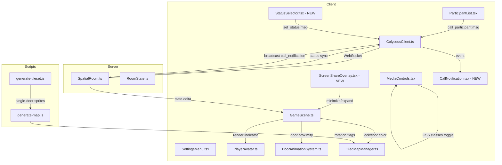

# Design Document: Room UX Improvements

## Overview

This design covers 10 UX improvements to the 7Gather spatial collaboration platform. The changes span the client React UI layer (MediaControls, ScreenShareOverlay, ParticipantList, SettingsMenu), the Phaser game scene (status indicators, lock indicators, door rendering), the Colyseus server state and message handlers (call system, status persistence, room reset fixes), and the asset generation scripts (tileset door sprites, map rotation flags).

The improvements are grouped into:
- **UI Polish** (Req 1, 2, 9): Toggle feedback, screen share minimize, settings cancel
- **Social Features** (Req 3, 4, 5): Call participant, persist status, avatar status indicator
- **Bug Fixes** (Req 6, 7, 8, 10): Floor color, room lock, room reset, door rendering

All changes are additive or corrective — no existing APIs are removed.

## Architecture



### Change Impact by Layer

| Layer | Files Modified | Files Created |
|-------|---------------|---------------|
| Client UI | MediaControls.tsx, ParticipantList.tsx, SettingsMenu.tsx | ScreenShareOverlay.tsx, CallNotification.tsx, StatusSelector.tsx |
| Client Game | GameScene.ts, PlayerAvatar.ts, DoorAnimationSystem.ts, TiledMapManager.ts | — |
| Client Network | ColyseusClient.ts | — |
| Client Styles | index.css | — |
| Server | SpatialRoom.ts, RoomState.ts | — |
| Scripts | generate-tileset.js, generate-map.js | — |
| Shared | types.ts, constants.ts | — |

## Components and Interfaces

### Requirement 1: Toggle Visual Feedback on Media Buttons

**Existing Component:** `MediaControls.tsx`

The component already applies `media-btn--on` / `media-btn--off` classes and sets `aria-pressed`. The CSS already defines these classes. The gap is:
- CSS transitions are not explicitly timed (add `transition: all 100ms ease`)
- Contrast ratio between on/off states needs verification (≥3:1 per WCAG 1.4.11)
- Disabled state needs a distinct visual (already has `opacity: 0.3`, needs `border-color` differentiation)

**Changes:**
- Update CSS for `.media-btn--on` and `.media-btn--off` to use explicit `transition: background-color 100ms ease, border-color 100ms ease, color 100ms ease`
- Ensure border colors provide ≥3:1 contrast between active and inactive states
- Add `.media-btn--disabled` class with distinct styling (grey border, crosshatch icon)

### Requirement 2: Screen Share Overlay Minimize

**New Component:** `ScreenShareOverlay.tsx`

```typescript
interface ScreenShareOverlayProps {
  stream: MediaStream | null;
  sharerName: string;
  onClose: () => void;
}

type OverlayState = 'full' | 'minimized' | 'hidden';
```

**Behavior:**
- Renders a `<video>` element with the remote screen share stream
- Full state: overlay covers the game viewport with a minimize button (top-right, 32×32 min touch target)
- Minimized state: thumbnail (max 120×80px) pinned bottom-right, `pointer-events: none` on container (only thumbnail is interactive)
- Escape key triggers minimize from full state
- When sharing stops (`stream` becomes null), component transitions to hidden

**CSS Animations:** Use `transition: all 300ms ease` for size/position changes.

### Requirement 3: Call Participant to Room

**Modified Component:** `ParticipantList.tsx`
- Add `onPoke: (sessionId: string) => void` prop
- Render a poke button (👉) next to each participant except `currentUserSessionId`

**New Component:** `CallNotification.tsx`

```typescript
interface CallNotificationProps {
  calls: CallInfo[];
  onGo: (callerId: string) => void;
  onDismiss: (callerId: string) => void;
}

interface CallInfo {
  callerId: string;
  callerName: string;
  timestamp: number;
  callerLeft: boolean;
}
```

**Server Message Flow:**
1. Client sends `call_participant` message: `{ targetSessionId: string }`
2. Server validates target exists and is connected
3. Server sends `call_notification` to target: `{ callerSessionId, callerName, timestamp }`
4. If caller leaves before response, server sends `call_expired` to target: `{ callerSessionId }`

**Client Handling:**
- Max 3 visible notifications (FIFO, discard oldest)
- Elapsed timer updates every 1s via `setInterval`
- Auto-dismiss after 60s
- "Ir" button calls `GameScene.navigateTo(callerX, callerY)` using existing pathfinding

### Requirement 4: Persist User Status

**New Component:** `StatusSelector.tsx`

```typescript
type UserStatus = 'available' | 'busy' | 'dnd';

interface StatusSelectorProps {
  currentStatus: UserStatus;
  onStatusChange: (status: UserStatus) => void;
}
```

**Persistence:**
- Read from `localStorage.getItem('user_status')` on mount
- Validate value is one of `'available' | 'busy' | 'dnd'`; default to `'available'` if invalid or missing
- Write to localStorage on change; silently catch write failures

**Server Sync:**
- Client sends `set_status` message: `{ status: UserStatus }`
- Server updates `PlayerSchema.status` field (new field)
- Delta sync broadcasts to all clients within configured `SYNC_RATE`

### Requirement 5: Status Indicator on Avatars

**Modified:** `PlayerAvatar.ts` and `RemoteAvatar` class

Add a `Phaser.GameObjects.Graphics` circle (8px diameter) offset (+8, +8) from sprite center, depth 12.

```typescript
private statusIndicator: Phaser.GameObjects.Graphics;
private currentStatus: UserStatus = 'available';

setStatus(status: UserStatus): void {
  this.currentStatus = status;
  this.statusIndicator.clear();
  this.statusIndicator.fillStyle(STATUS_COLORS[status], 1);
  this.statusIndicator.fillCircle(0, 0, 4); // radius = 4 for 8px diameter
}
```

**Color Map (from constants.ts):**
| Status | Color | Hex |
|--------|-------|-----|
| available | green | #4cdf8b |
| busy | yellow | #ffb347 |
| dnd | red | #ff6b6b |

**Update Loop:** In `PlayerAvatar.update()` and `RemoteAvatar.update()`, reposition the indicator relative to sprite position every frame.

### Requirement 6: Fix Floor Color Application

**Bug:** The `applyZoneFloorColor` in GameScene applies tint to all tiles with index 10 across all layers, including Physics. It should only target the Ground layer.

**Fix in `TiledMapManager.applyFloorTint()`:**
- Already targets Ground layer by iterating `this.groundLayer.getTilesWithin(...)`. Verify that the filter correctly checks `tile.index === 10` (0-indexed in Phaser, so actually GID 11 in Tiled — need to confirm with firstgid offset).
- The server-side handler already validates `colorIndex` range 0–17 and owner check.

### Requirement 7: Fix Room Lock System

**Current State:** The lock/unlock handler and `DoorAnimationSystem.setZoneLocked()` already exist. Issues to fix:
- PadlockIcon toggle animation timing (ensure single React render cycle)
- Lock indicator rendering at depth 6 on door tiles adjacent to zone
- `DoorAnimationSystem` already handles locked zones; verify `setLockedDoor` / `clearLockedDoor` are called properly
- Movement rejection for non-owners entering locked zones already implemented in `SpatialRoom.onMessage("move")`

**Fixes:**
- Ensure `GameScene.applyZoneLockState()` calls `this.doorSystem.setZoneLocked(zoneId, isLocked)` synchronously
- Ensure `bindRoomState` processes `zones.onAdd` for initial state on join/reconnect
- Verify lock indicator depth is 6 (currently may be higher)

### Requirement 8: Room Reset Removes Lock and Color

**Current State:** The `release_room` handler already sets `isLocked = false`, `floorColorIndex = -1`, and `ownerSessionId = ""`.

**Fix:** Ensure the client side reacts to all three changes atomically:
- On state change to `isLocked = false`: remove lock indicators, clear locked doors
- On state change to `floorColorIndex = -1`: clear floor tint
- These are already triggered by Colyseus `onChange` callbacks in `bindRoomState`

The server code already processes these in sequence within a single handler (same state patch cycle). Verify client-side listeners handle the triple change correctly.

### Requirement 9: Cancel Button in Settings

**Modified:** `SettingsMenu.tsx`

**Changes:**
- Store `initialName` and `initialAvatarId` as refs on panel open
- Add "Cancelar" button left of "Salvar e Reentrar"
- On click: revert `name` and `selectedAvatar` to initial values, close panel
- Disable "Cancelar" when form matches initial values (`!hasChanges`)

```typescript
const handleCancel = useCallback(() => {
  setName(currentName);
  setSelectedAvatar(currentAvatarId);
  setIsOpen(false);
}, [currentName, currentAvatarId]);
```

### Requirement 10: Fix Door Rendering

**Script Changes:**

1. **generate-tileset.js** — Replace `generateClosedDoor()` and `generateOpenDoor()` with single-panel versions:
   - Closed: one panel filling the full 32×32 tile (no center gap)
   - Open: panel retracted to one side (left edge), open space on right

2. **generate-map.js** — Apply Tiled rotation flags for east/west doors:
   - Tiled uses a flipped-diagonal bit (bit 29 = 0x20000000) for 90° clockwise rotation
   - East/west door tiles: `gid | 0x20000000` 
   - North/south door tiles: plain `gid` (no rotation)

3. **TiledMapManager.ts** — Already handles rotation flags from Tiled data (Phaser's tilemap loader reads flip bits). Verify `detectDoorTiles()` correctly strips flip bits when comparing tile indices.

## Data Models

### State Schema Changes (RoomState.ts)

```typescript
// Add to PlayerSchema:
@type("string") status: string = "available"; // "available" | "busy" | "dnd"

// ZoneStateSchema — no changes needed (already has isLocked, floorColorIndex, ownerSessionId)
```

### New Message Types (shared/types.ts)

```typescript
// Client → Server
export interface CallParticipantMessage {
  targetSessionId: string;
}

export interface SetStatusMessage {
  status: 'available' | 'busy' | 'dnd';
}

// Server → Client
export interface CallNotificationMessage {
  callerSessionId: string;
  callerName: string;
  timestamp: number;
}

export interface CallExpiredMessage {
  callerSessionId: string;
}
```

### localStorage Keys

| Key | Type | Values | Default |
|-----|------|--------|---------|
| `user_status` | string | `"available"`, `"busy"`, `"dnd"` | `"available"` |

### Constants (constants.ts)

```typescript
export const STATUS_COLORS: Record<string, number> = {
  available: 0x4cdf8b,
  busy: 0xffb347,
  dnd: 0xff6b6b,
};

export const CALL_TIMEOUT_MS = 60_000;
export const MAX_VISIBLE_CALLS = 3;
export const SCREEN_SHARE_THUMBNAIL_WIDTH = 120;
export const SCREEN_SHARE_THUMBNAIL_HEIGHT = 80;
```

## Correctness Properties

*A property is a characteristic or behavior that should hold true across all valid executions of a system — essentially, a formal statement about what the system should do. Properties serve as the bridge between human-readable specifications and machine-verifiable correctness guarantees.*

### Property 1: Media button visual state reflects logical state

*For any* media button (mic, camera, screen share) and *for any* sequence of toggle operations, the CSS class applied (`media-btn--on` or `media-btn--off`) SHALL always correspond to the current boolean state (`aria-pressed` value), and a disabled button SHALL never transition to on/off states.

**Validates: Requirements 1.1, 1.2, 1.3, 1.5, 1.6**

### Property 2: Screen share overlay state machine transitions

*For any* sequence of user interactions (minimize click, thumbnail click, Escape key, sharing stops), the ScreenShareOverlay state SHALL follow valid transitions: `full → minimized`, `minimized → full`, `full|minimized → hidden`, and no other transitions SHALL occur. The game scene SHALL be fully interactive when state is `minimized`.

**Validates: Requirements 2.2, 2.3, 2.4, 2.5, 2.6**

### Property 3: Call notification stacking respects FIFO with max 3

*For any* sequence of N incoming call notifications (N ≥ 0), the visible notifications SHALL be at most 3, representing the 3 most recent calls, and the order SHALL be newest at bottom.

**Validates: Requirements 3.5**

### Property 4: Status persistence round trip

*For any* valid status value written to localStorage, reading it back and applying it as the initial status SHALL produce the same value. *For any* invalid or missing localStorage value, the system SHALL default to "available".

**Validates: Requirements 4.1, 4.2, 4.3**

### Property 5: Status indicator color mapping is total and correct

*For any* status value in the domain {"available", "busy", "dnd"}, the status indicator color SHALL map to exactly one color (#4cdf8b, #ffb347, #ff6b6b respectively), and *for any* undefined/null status, it SHALL default to the "available" color.

**Validates: Requirements 5.2, 5.3, 5.4, 5.7**

### Property 6: Floor color owner authorization

*For any* `set_floor_color` message, the server SHALL accept the message if and only if the sender's sessionId matches the zone's `ownerSessionId` AND the colorIndex is an integer in [0, 17]. Otherwise the zone state SHALL remain unchanged.

**Validates: Requirements 6.4, 6.6**

### Property 7: Room lock authorization and movement rejection

*For any* move message targeting a tile inside a locked zone, the server SHALL accept the move if and only if the sender is the zone owner. Non-owner moves SHALL be rejected with position unchanged.

**Validates: Requirements 7.7, 7.8**

### Property 8: Room reset atomically clears all zone properties

*For any* valid `release_room` message from the zone owner, the resulting zone state SHALL have `isLocked = false`, `floorColorIndex = -1`, and `ownerSessionId = ""`. *For any* `release_room` from a non-owner, the zone state SHALL remain unchanged.

**Validates: Requirements 8.1, 8.2, 8.3, 8.6**

### Property 9: Settings cancel reverts to initial values

*For any* sequence of form modifications (name changes, avatar selections) followed by clicking "Cancelar", the form state SHALL equal the values captured when the panel was opened. No localStorage writes or page reloads SHALL occur.

**Validates: Requirements 9.2, 9.3**

### Property 10: Door rotation flag correctness

*For any* door tile placed on an east or west wall, the tile data SHALL include the Tiled flipped-diagonal rotation bit (0x20000000). *For any* door tile placed on a north or south wall, the tile data SHALL have no rotation flags (raw GID only).

**Validates: Requirements 10.2, 10.3**

### Property 11: Call auto-dismiss after timeout

*For any* call notification, if 60 seconds elapse without the user clicking "Ir", the notification SHALL be automatically dismissed. No stale notifications SHALL remain visible past the timeout.

**Validates: Requirements 3.9**

## Error Handling

| Scenario | Handling |
|----------|----------|
| localStorage unavailable (Status Selector) | Catch write error silently; use in-memory status and notify server normally |
| Call target disconnected | Server validates target exists in `state.players`; returns error to caller |
| Invalid floor color index | Server rejects message (existing validation: `0 ≤ index < 18`) |
| Lock/unlock from non-owner | Server discards message silently (existing behavior) |
| Screen share stream ends unexpectedly | `video.onended` event triggers transition to hidden state |
| Call notification for departed caller | Server broadcasts `call_expired`; client disables "Ir" button and shows message |
| Pathfinding fails (navigateTo) | `TiledMapManager.findPath()` returns empty array; avatar stays in place |
| Tileset regeneration fails | Script exits with error code; CI prevents deployment of broken assets |

## Testing Strategy

### Unit Tests (Vitest + @testing-library/react)

| Component | Test Focus |
|-----------|-----------|
| MediaControls | Class toggling, aria-pressed sync, disabled state |
| ScreenShareOverlay | State transitions, Escape key handler, cleanup |
| CallNotification | Stacking, auto-dismiss timer, elapsed time format |
| StatusSelector | localStorage read/write, default fallback, validation |
| SettingsMenu | Cancel reverts values, disabled state when unchanged |
| SpatialRoom handlers | Owner validation, color index bounds, release atomicity |

### Property-Based Tests (Vitest + fast-check)

Property-based testing is appropriate for this feature because several requirements involve:
- Pure validation logic (color index range, status values, authorization checks)
- State machine transitions (screen share overlay, media toggles)
- Round-trip persistence (status to/from localStorage)
- Authorization invariants (owner-only operations)

**Configuration:**
- Minimum 100 iterations per property test
- Library: `fast-check` (already compatible with Vitest)
- Tag format: `Feature: room-ux-improvements, Property {N}: {title}`

**Properties to implement:**
1. Media button visual state consistency
2. Screen share overlay state machine validity
3. Call notification FIFO stacking (max 3)
4. Status persistence round trip
5. Status indicator color mapping totality
6. Floor color owner authorization
7. Room lock movement rejection
8. Room reset atomicity
9. Settings cancel revert
10. Door rotation flag correctness
11. Call auto-dismiss after timeout

### Integration Tests

| Scenario | Approach |
|----------|----------|
| Full call flow (send → receive → navigate) | Mock Colyseus room, verify message sequence |
| Lock system end-to-end | Start SpatialRoom, simulate lock + move rejection |
| Floor color application on map tiles | Load test map, apply tint, verify correct layer targeted |
| Room reset with active lock + color | Verify all three properties reset and client reacts |

### Visual / Manual Testing

- Door sprite appearance after tileset regeneration
- Media button contrast ratio measurement (DevTools accessibility audit)
- Screen share thumbnail positioning at various viewport sizes
- Status indicator visibility at different zoom levels
