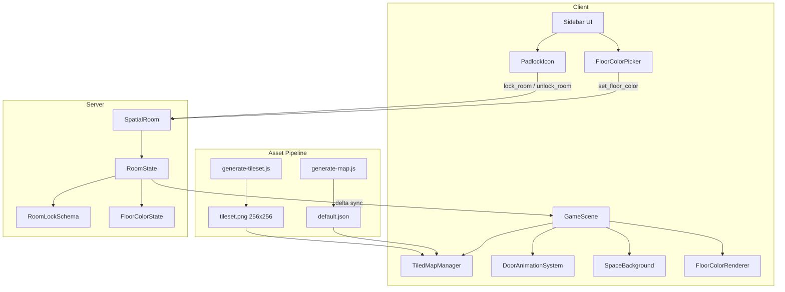

# Design Document: Space Theme Room Decoration

## Overview

This feature transforms the 7Gather virtual office from its current green-grass aesthetic into a futuristic 8-bit space station theme. The redesign spans the full stack: asset generation scripts produce a space-themed tileset and updated map JSON, the client-side GameScene renders new tiles with animations (doors, stars, comets), and the server-side SpatialRoom gains room locking and floor color state management.

The feature decomposes into five subsystems:

1. **Asset Generation** — Updated `generate-tileset.js` and `generate-map.js` to produce space-themed tiles and place furniture/decorative objects
2. **Map Rendering** — Extended `TiledMapManager` and `GameScene` to handle Objects layer collision, door tile tracking, and tile tint application
3. **Door Animation** — Client-side proximity detection triggering tile swaps on the Objects layer
4. **Space Background** — A dedicated Phaser layer behind the tilemap with stars, twinkle animations, and occasional comets
5. **Server State** — New Colyseus schema fields for room lock state and floor color index, with message handlers for ownership-validated mutations

### Design Decisions

- **No new dependencies**: All rendering uses existing Phaser 3 APIs (tint, tile swaps, graphics primitives). No sprite animation framework needed since doors use tile index swapping rather than spritesheet animation.
- **Objects layer as tile layer**: The current map uses Objects as an objectgroup for zone definitions. The redesign adds a parallel tile layer (`Objects` as a tilelayer) for door/chair/decorative tiles, while zone definitions remain in the objectgroup. The map JSON will contain both.
- **Server-authoritative locking**: Room lock state lives in Colyseus RoomState so all clients see lock indicators. Movement rejection is server-side to prevent bypasses.
- **Color via tint, not separate tiles**: Floor color customization uses Phaser's `tile.tint` API applied at runtime, preserving the 64-slot tileset capacity.

## Architecture



### Layer Architecture (Phaser Rendering Order)

```
Depth 0: SpaceBackground (stars, comets) — below everything
Depth 1: Ground layer (space floor tiles, corridor tiles)
Depth 2: Physics layer (walls, desks, meeting table — collision)
Depth 3: Objects tile layer (doors, chairs, decoratives)
Depth 4: Avatars (local + remote)
Depth 5: Top layer (space windows, wall tops)
Depth 6: UI overlays (lock indicators, name labels)
```

## Components and Interfaces

### 1. Tileset Generator (`scripts/generate-tileset.js`)

Produces a 256×256 PNG with 64 tiles (8×8 grid of 32×32 tiles).

**Tile Index Allocation:**

| Index | Purpose | Collision |
|-------|---------|-----------|
| 0 | Space ground (dark + stars) | No |
| 1 | Corridor floor (grid pattern) | No |
| 2 | Wall (metallic panels + rivets) | Yes |
| 10 | Private zone floor (purple glow) | No |
| 11 | Zone detection (Physics layer) | No |
| 12 | Desk with notebook | Yes |
| 13 | Chair (futuristic) | No |
| 14 | Meeting table segment | Yes |
| 15 | Closed door | No |
| 16 | Open door | No |
| 17 | Space window | No |
| 18–23 | Decorative objects (2–6 tiles) | Mixed |

**Tile Properties in tileset `tiles` array:**
```json
[
  { "id": 2, "properties": [{ "name": "collide", "type": "bool", "value": true }] },
  { "id": 10, "properties": [{ "name": "jitsiRoom", "type": "string", "value": "" }] },
  { "id": 12, "properties": [{ "name": "collide", "type": "bool", "value": true }] },
  { "id": 14, "properties": [{ "name": "collide", "type": "bool", "value": true }] },
  { "id": 15, "properties": [{ "name": "doorState", "type": "string", "value": "closed" }] },
  { "id": 16, "properties": [{ "name": "doorState", "type": "string", "value": "open" }] }
]
```

### 2. Map Generator (`scripts/generate-map.js`)

Updated to produce a Tiled JSON with 5 layers:

- **Ground** (tilelayer): Space ground (index 0) everywhere, corridor tiles (index 1) in hallways
- **Physics** (tilelayer): Walls (index 2), zone tiles (index 11), desk tiles (index 12), meeting table tiles (index 14)
- **ObjectsTiles** (tilelayer): Door tiles (index 15), chair tiles (index 13), decorative objects (18+)
- **Objects** (objectgroup): Zone definitions with `jitsiRoom` property (unchanged)
- **Top** (tilelayer): Space window tiles (index 17) on back walls

**Furniture Placement Rules:**
- Desk: relative position (col 2, row 1) from room interior top-left, shifted inward if doorway conflicts
- Chair: orthogonally adjacent to desk, opposite side from doorway
- Meeting table: centered rectangular group (4×2 to 8×4) in the 12×8 meeting room
- Meeting chairs: 8–16 tiles adjacent to table perimeter, avoiding doorways

### 3. TiledMapManager Extensions

```typescript
interface DoorTile {
  tileX: number;
  tileY: number;
  closedIndex: number;
  openIndex: number;
  isOpen: boolean;
}

// New method signatures
class TiledMapManager {
  // Existing
  loadMap(mapKey, tilesetKey, tilesetName): TiledMapConfig;
  isColliding(x, y): boolean;  // Extended to check ObjectsTiles layer
  
  // New
  getDoorTiles(): DoorTile[];
  setDoorState(tileX: number, tileY: number, open: boolean): void;
  getObjectsTileLayer(): Phaser.Tilemaps.TilemapLayer | null;
  applyFloorTint(zone: PrivateZone, color: number): void;
  clearFloorTint(zone: PrivateZone): void;
}
```

The `isColliding` method is extended to also check the ObjectsTiles layer for tiles with `collide: true` property, in addition to the existing Physics layer check.

### 4. DoorAnimationSystem

A new class managed by GameScene that handles door proximity detection and tile swapping.

```typescript
class DoorAnimationSystem {
  private doors: DoorTile[];
  private objectsLayer: Phaser.Tilemaps.TilemapLayer;
  
  constructor(mapManager: TiledMapManager, objectsLayer: Phaser.Tilemaps.TilemapLayer);
  
  /** Called every frame from GameScene.update() */
  update(localAvatarTileX: number, localAvatarTileY: number, 
         remotePositions: Map<string, {tileX: number, tileY: number}>): void;
  
  /** Manhattan distance check */
  private isWithinThreshold(doorX: number, doorY: number, 
                            avatarX: number, avatarY: number, threshold: number): boolean;
}
```

**Logic:**
- For each door tile, compute Manhattan distance to all avatar positions (local + remote)
- If any avatar is within 1 tile of a closed door → swap to open index
- If all avatars are beyond 2 tiles of an open door → swap to closed index
- Tile swap is immediate (within single frame, well under 300ms requirement)

### 5. SpaceBackground

A dedicated rendering system for the deep-space background visible beyond map edges.

```typescript
class SpaceBackground {
  private stars: { x: number; y: number; size: number; graphics: Phaser.GameObjects.Graphics }[];
  private twinkleTimers: Phaser.Time.TimerEvent[];
  private activeTwinkles: number;
  private cometTimer: Phaser.Time.TimerEvent;
  
  constructor(scene: Phaser.Scene, mapWidth: number, mapHeight: number);
  
  /** Create background fill and scatter stars */
  create(): void;
  
  /** Update twinkle and comet animations */
  update(time: number, delta: number): void;
  
  destroy(): void;
}
```

**Implementation:**
- Background: Large rectangle at depth 0, color RGB(10, 10, 25), extends well beyond map bounds
- Stars: 40–120 small circles/rectangles at random world positions, white/light-blue tint
- Twinkle: Timer-driven alpha tween on individual stars, max 3 concurrent, interval 500–3000ms
- Comet: Small diagonal-moving graphic, interval 8–20s, traverses in 2–4s

### 6. Room Lock UI (PadlockIcon)

A React component in the Sidebar that toggles room lock state.

```typescript
interface PadlockIconProps {
  isLocked: boolean;
  onToggle: () => void;
}

const PadlockIcon: React.FC<PadlockIconProps>;
```

### 7. Floor Color Picker UI

A React component displaying 18 color swatches.

```typescript
interface FloorColorPickerProps {
  currentColorIndex: number | null;
  onSelectColor: (index: number) => void;
}

const FloorColorPicker: React.FC<FloorColorPickerProps>;
```

### 8. Server Message Handlers (SpatialRoom extensions)

New messages:
- `"lock_room"` — Toggle room lock. Validated: sender must be room owner.
- `"unlock_room"` — Toggle room unlock. Validated: sender must be room owner.
- `"set_floor_color"` — Set floor color index (0–17). Validated: sender must be room owner, index in range.
- `"move"` — Extended: reject movement into locked rooms for non-owners.

## Data Models

### Extended Colyseus Schemas

```typescript
// New schema for per-room state (lock + floor color)
class ZoneStateSchema extends Schema {
  @type("string") zoneId: string = "";
  @type("boolean") isLocked: boolean = false;
  @type("string") ownerSessionId: string = "";
  @type("int8") floorColorIndex: number = -1;  // -1 = no tint
}

// Extended RoomState
class RoomState extends Schema {
  @type({ map: PlayerSchema }) players = new MapSchema<PlayerSchema>();
  @type(MusicSchema) music: MusicSchema = new MusicSchema();
  @type("string") mapVersion: string = "";
  @type({ map: ZoneStateSchema }) zones = new MapSchema<ZoneStateSchema>();  // NEW
}
```

### Floor Color Palette (constants)

```typescript
// src/shared/constants.ts
export const FLOOR_COLORS: readonly string[] = [
  '#2D1B69', // 0: deep purple
  '#00E5FF', // 1: cyan glow
  '#39FF14', // 2: neon green
  '#8B0000', // 3: dark red
  '#1A237E', // 4: blue nebula
  '#7C4DFF', // 5: violet
  '#FF00FF', // 6: magenta
  '#008080', // 7: teal
  '#FF6D00', // 8: dark orange
  '#0D47A1', // 9: cosmic blue
  '#00C853', // 10: emerald
  '#DC143C', // 11: crimson
  '#3F00FF', // 12: indigo
  '#FFD700', // 13: gold
  '#C0C0C0', // 14: silver
  '#00CED1', // 15: turquoise
  '#B388FF', // 16: lavender
  '#FF007F', // 17: rose
] as const;

export const FLOOR_COLOR_COUNT = 18;
```

### Door Tile Data Structure

```typescript
// Used internally by TiledMapManager and DoorAnimationSystem
interface DoorTileEntry {
  tileX: number;
  tileY: number;
  closedTileIndex: number;  // e.g., 15
  openTileIndex: number;    // e.g., 16
  currentState: 'open' | 'closed';
}
```

### Tileset Metadata (in Tiled JSON)

```json
{
  "tilesets": [{
    "columns": 8,
    "firstgid": 1,
    "image": "/maps/tileset.png",
    "imageheight": 256,
    "imagewidth": 256,
    "name": "tileset",
    "tilecount": 64,
    "tileheight": 32,
    "tilewidth": 32,
    "tiles": [
      { "id": 2, "properties": [{ "name": "collide", "type": "bool", "value": true }] },
      { "id": 10, "properties": [{ "name": "jitsiRoom", "type": "string", "value": "" }] },
      { "id": 12, "properties": [{ "name": "collide", "type": "bool", "value": true }] },
      { "id": 14, "properties": [{ "name": "collide", "type": "bool", "value": true }] },
      { "id": 15, "properties": [{ "name": "doorState", "type": "string", "value": "closed" }] },
      { "id": 16, "properties": [{ "name": "doorState", "type": "string", "value": "open" }] },
      { "id": 18, "properties": [{ "name": "collide", "type": "bool", "value": true }] }
    ]
  }]
}
```

### Map Layer Structure (updated default.json)

```json
{
  "layers": [
    { "name": "Ground", "type": "tilelayer", "data": [...] },
    { "name": "Physics", "type": "tilelayer", "data": [...] },
    { "name": "ObjectsTiles", "type": "tilelayer", "data": [...] },
    { "name": "Objects", "type": "objectgroup", "objects": [...] },
    { "name": "Top", "type": "tilelayer", "data": [...] }
  ]
}
```

## Correctness Properties

*A property is a characteristic or behavior that should hold true across all valid executions of a system — essentially, a formal statement about what the system should do. Properties serve as the bridge between human-readable specifications and machine-verifiable correctness guarantees.*

### Property 1: Collision tiles block movement

*For any* tile position on either the Physics layer or ObjectsTiles layer that has the `collide: true` property set (including wall tiles at index 2, desk tiles at index 12, and meeting table tiles at index 14), `isColliding()` called with the pixel coordinates of that tile SHALL return `true`.

**Validates: Requirements 2.3, 4.3, 6.3, 8.3, 8.5**

### Property 2: Non-collision tiles allow passage

*For any* tile position that contains a tile without the `collide: true` property (including zone floor tiles at index 11, chair tiles at index 13, door tiles at indices 15/16, and space window tiles at index 17), that tile SHALL NOT contribute to collision — specifically, a tile on the ObjectsTiles layer without `collide: true` shall not cause `isColliding()` to return `true` for that position (unless the Physics layer independently blocks it).

**Validates: Requirements 3.2, 5.3, 7.3, 8.4**

### Property 3: Zone detection correctness

*For any* Tiled map containing tiles with index 11 on the Physics layer that fall within an Objects layer zone definition rectangle (with `jitsiRoom` property), `detectPrivateZones()` SHALL produce a PrivateZone record whose `id` matches the zone's `jitsiRoom` value, whose `tiles` array contains all tile positions with index 11 within that rectangle, and whose `bounds` rectangle encompasses all those tiles.

**Validates: Requirements 3.3**

### Property 4: Doorway reachability after object placement

*For any* generated map with decorative and furniture objects placed, BFS pathfinding from any room doorway tile to any other room doorway tile SHALL find a valid path consisting of non-collision tiles.

**Validates: Requirements 9.3**

### Property 5: Door tile detection completeness

*For any* map containing tiles on the ObjectsTiles layer with a `doorState` property, `getDoorTiles()` SHALL return a DoorTile entry for every such tile position, with the correct `closedIndex` and `openIndex` values derived from the tileset tile properties.

**Validates: Requirements 12.5**

### Property 6: Door proximity opens

*For any* closed door tile and any set of avatar positions (local or remote), if at least one avatar has a Manhattan distance of 1 or less from the door tile, then after the DoorAnimationSystem `update()` executes, the door tile SHALL be in the open state.

**Validates: Requirements 13.1, 13.4, 13.6**

### Property 7: Door distance closes

*For any* open door tile, if all tracked avatar positions (local and remote) have a Manhattan distance greater than 2 from the door tile, then after the DoorAnimationSystem `update()` executes, the door tile SHALL be in the closed state.

**Validates: Requirements 13.2**

### Property 8: Locked room access control

*For any* movement message that would place a player inside a locked room's zone tiles, the SpatialRoom server SHALL allow the movement if and only if the player is the room's owner. Non-owner movement into the locked zone SHALL be rejected with the player's position unchanged.

**Validates: Requirements 14.5, 14.7**

### Property 9: Maximum concurrent twinkle animations

*For any* point in time during the SpaceBackground animation lifecycle, the number of stars simultaneously in a twinkle animation state SHALL NOT exceed 3.

**Validates: Requirements 15.4**

### Property 10: Floor color change validation

*For any* `set_floor_color` message received by the SpatialRoom server, the server SHALL accept and apply the change if and only if (a) the sender's session ID matches the owner of the target room AND (b) the `Floor_Color_Index` is an integer in the range 0–17 inclusive. All other messages SHALL be rejected with no state modification.

**Validates: Requirements 16.6, 16.7, 16.8**

## Error Handling

### Asset Generation Errors

| Error Condition | Handling |
|---|---|
| Tileset PNG dimensions mismatch (not 256×256) | GameScene logs error to console, refuses to load map |
| Missing tile layer in map JSON | TiledMapManager throws descriptive error in `loadMap()` |
| Invalid tile index in map data (> 63) | Phaser renders empty tile; no crash |
| ObjectsTiles layer missing | TiledMapManager creates null placeholder, skips Objects collision |

### Server-Side Validation Errors

| Message | Invalid Input | Response |
|---|---|---|
| `lock_room` | Sender is not room owner | Silently ignored, no state change |
| `set_floor_color` | Index outside 0–17 or non-integer | Silently ignored, no state change |
| `set_floor_color` | Sender is not room owner | Silently ignored, no state change |
| `move` | Position inside locked room (non-owner) | Reject, send `"room_locked"` notification to client, keep previous position |
| `move` | Position out of map bounds | Reject silently (existing behavior) |

### Client-Side Error Handling

| Scenario | Handling |
|---|---|
| Door tile swap fails (tile not found) | Log warning, skip swap, door stays in current state |
| Floor tint color index is null/undefined | Render zone tiles with no tint (default appearance) |
| SpaceBackground star count below minimum | Ensure minimum 40 stars, log warning if randomizer produced less |
| Comet sprite fails to create | Skip comet animation, background continues without it |
| Disconnect during lock toggle | Room lock state is server-authoritative; client reconciles on reconnection |

### Reconnection and Lock State

- If room owner disconnects while room is locked, the server maintains the lock for `RECONNECT_TIMEOUT_MS` (5000ms)
- After timeout expiry without reconnection, server sets `isLocked = false` on the zone state
- Reconnecting clients receive full state snapshot including current lock/color states

## Testing Strategy

### Unit Tests (Vitest)

Unit tests verify specific behaviors with concrete examples:

- **Tileset Generator**: Pixel color assertions for each tile type, dimension checks, palette validation
- **Map Generator**: Room count, furniture placement positions, doorway verification, chair distribution
- **TiledMapManager.isColliding**: Specific tile positions with known collision state
- **DoorAnimationSystem**: Specific avatar positions relative to doors, verifying state transitions
- **FloorColorPicker component**: Render with various props, verify swatch count and highlight
- **PadlockIcon component**: Render states (locked/unlocked), click handlers
- **SpatialRoom message handlers**: Specific lock/unlock/color messages with valid and invalid inputs

### Property-Based Tests (Vitest + fast-check)

Property tests verify universal invariants across randomized inputs. Use the `fast-check` library for property-based testing with Vitest.

**Configuration:**
- Minimum 100 iterations per property test
- Each test tagged with feature and property reference

**Property test targets:**

1. **Collision system** (Properties 1 & 2): Generate random tile maps with various collide/non-collide tiles, verify isColliding behavior matches tile properties
2. **Zone detection** (Property 3): Generate random zone tile configurations within zone rectangles, verify detection output
3. **Doorway reachability** (Property 4): Generate maps with varying decorative placements, verify BFS connectivity
4. **Door detection** (Property 5): Generate ObjectsTiles layers with door tiles at random positions, verify getDoorTiles finds them all
5. **Door proximity** (Properties 6 & 7): Generate random avatar positions and door positions, verify open/close logic matches Manhattan distance rules
6. **Room lock access** (Property 8): Generate random player sessions, room ownership, lock states, and movement targets, verify accept/reject logic
7. **Twinkle invariant** (Property 9): Simulate time progression with randomized twinkle triggers, verify max 3 concurrent
8. **Floor color validation** (Property 10): Generate random session IDs, ownership mappings, and color indices, verify accept/reject logic

**Test tag format:**
```typescript
// Feature: space-theme-room-decoration, Property 1: Collision tiles block movement
```

### Integration Tests

- Full GameScene load with new tileset/map, verify no console errors
- Door animation end-to-end (avatar movement triggers door state change)
- Colyseus room lock state synchronization across multiple clients
- Floor color tint application after state sync

