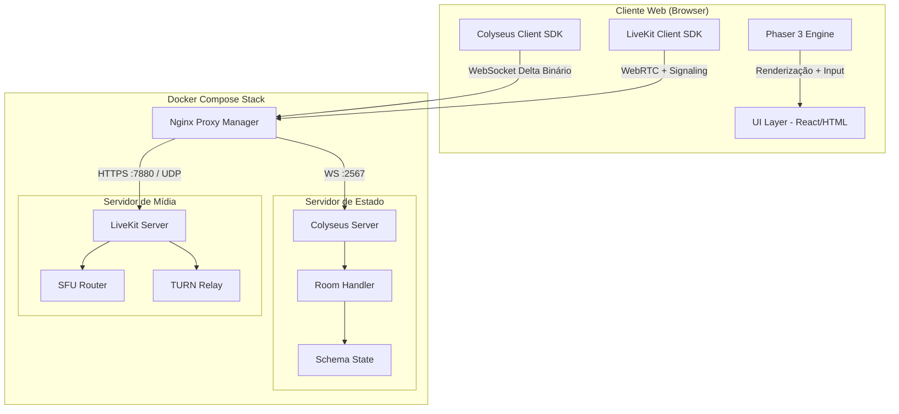
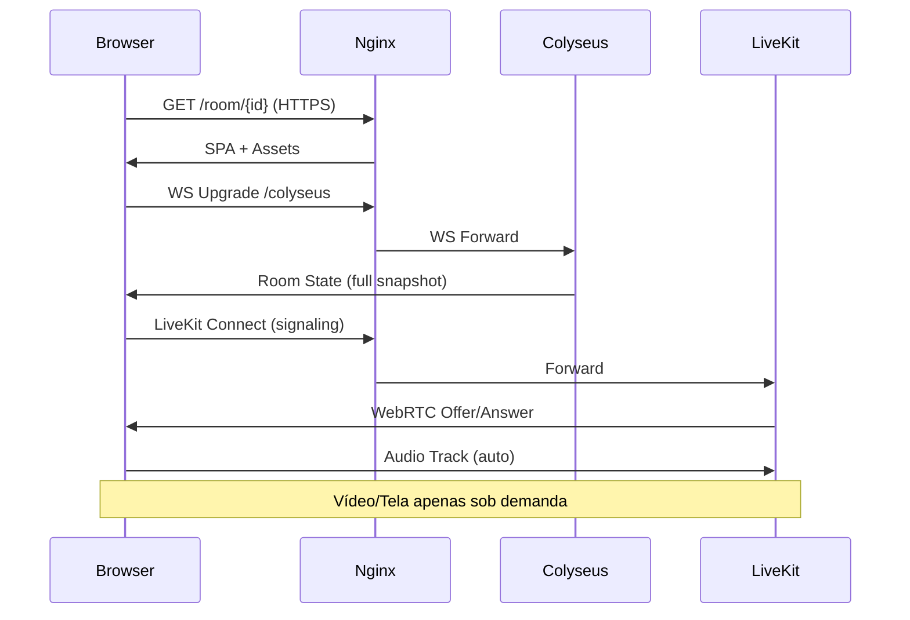
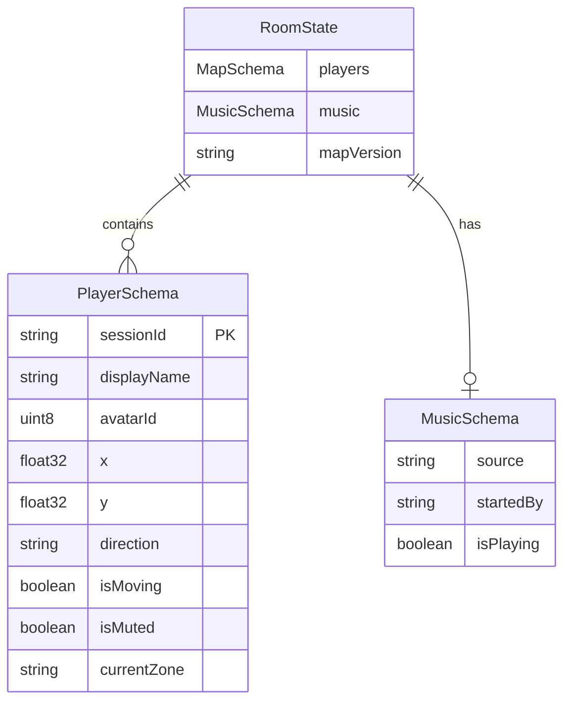

# Design Document: Spatial Collaboration Platform

## Overview

A plataforma de colaboração espacial é um escritório virtual 2D auto-hospedado que permite equipes interagirem em tempo real através de avatares navegáveis, áudio compartilhado por sala, vídeo/tela sob demanda, e zonas privadas para reuniões. A arquitetura segue um modelo cliente-servidor com três componentes centrais: renderização no cliente (Phaser 3), sincronização de estado (Colyseus via WebSocket), e mídia em tempo real (LiveKit SFU via WebRTC).

### Decisões Arquiteturais Chave

| Decisão | Escolha | Justificativa |
|---------|---------|---------------|
| Motor de renderização | Phaser 3 | Framework 2D maduro com suporte a tilemaps, física arcade e animações sprite |
| Sincronização de estado | Colyseus | Framework otimizado para jogos multiplayer com serialização delta binária nativa |
| Servidor de mídia | LiveKit SFU | Open-source, auto-hospedável, SDK TypeScript robusto, suporte a Simulcast |
| Protocolo de estado | WebSocket com Delta Binário | Latência baixa (~200ms), eficiente em banda para 20 updates/sec |
| Protocolo de mídia | WebRTC via SFU | Padrão da indústria para áudio/vídeo com latência <200ms |
| Deploy | Docker Compose + Nginx | Simplicidade operacional, reversibilidade, ambiente consistente |
| Persistência cliente | LocalStorage | Suficiente para avatar ID, sem necessidade de backend auth para MVP |

## Architecture

### Diagrama de Alto Nível



### Fluxo de Conexão



## Components and Interfaces

### 1. Cliente Web (Frontend)

#### 1.1 Game Engine Module (`src/client/game/`)

```typescript
// src/client/game/GameScene.ts
interface GameSceneConfig {
  mapJsonUrl: string;
  avatarId: number; // 1-20
  roomId: string;
}

class GameScene extends Phaser.Scene {
  private avatar: PlayerAvatar;
  private remotePlayers: Map<string, RemoteAvatar>;
  private mapManager: TiledMapManager;
  private networkSync: NetworkSync;
  private followTarget: string | null;
  private locateLine: Phaser.GameObjects.Line | null;

  create(config: GameSceneConfig): void;
  update(time: number, delta: number): void;
  
  // Movimentação: 4 tiles/sec, colisão apenas com Physics layer
  handleInput(cursors: Phaser.Types.Input.Keyboard.CursorKeys): void;
  
  // Follow automatizado
  startFollow(targetSessionId: string): void;
  stopFollow(): void;
  
  // Localização visual
  showLocateLine(targetSessionId: string): void;
  hideLocateLine(): void;
}
```

```typescript
// src/client/game/TiledMapManager.ts
interface TiledMapConfig {
  json: TiledJSON;
  layers: {
    ground: Phaser.Tilemaps.TilemapLayer;
    physics: Phaser.Tilemaps.TilemapLayer;
    objects: Phaser.Tilemaps.TilemapLayer;
    top: Phaser.Tilemaps.TilemapLayer;
  };
  privateZones: PrivateZone[];
}

interface PrivateZone {
  id: string;           // valor da propriedade "jitsiRoom"
  bounds: Phaser.Geom.Rectangle;
  tiles: Phaser.Math.Vector2[];
}

class TiledMapManager {
  loadMap(url: string): Promise<TiledMapConfig>;
  isColliding(x: number, y: number): boolean;
  getPrivateZoneAt(tileX: number, tileY: number): PrivateZone | null;
  validateMapFile(json: unknown): MapValidationResult;
}
```

```typescript
// src/client/game/PlayerAvatar.ts
interface AvatarState {
  sessionId: string;
  avatarId: number;    // 1-20
  x: number;          // tile position
  y: number;          // tile position
  direction: Direction;
  isMoving: boolean;
  isMuted: boolean;
}

type Direction = 'up' | 'down' | 'left' | 'right';

const AVATAR_SPEED = 4; // tiles per segundo
const TILE_SIZE = 32;   // pixels

class PlayerAvatar {
  move(direction: Direction, delta: number): boolean; // retorna false se colidiu
  setPosition(x: number, y: number): void;
  playWalkAnimation(direction: Direction): void;
  playIdleAnimation(): void;
  setMuteIndicator(muted: boolean): void;
}
```

#### 1.2 Network Module (`src/client/network/`)

```typescript
// src/client/network/ColyseusClient.ts
interface RoomJoinOptions {
  roomId: string;
  avatarId: number;
  displayName: string;
}

class ColyseusClient {
  private client: Colyseus.Client;
  private room: Colyseus.Room<RoomState> | null;
  private reconnectAttempts: number;
  private positionQueue: PositionUpdate[];

  connect(serverUrl: string): Promise<void>;
  joinRoom(options: RoomJoinOptions): Promise<Colyseus.Room<RoomState>>;
  sendPosition(x: number, y: number, direction: Direction): void;
  
  // Reconexão com fila de posições (até 5 segundos)
  onDisconnect(callback: (code: number) => void): void;
  attemptReconnect(): Promise<boolean>;
  flushPositionQueue(): void;

  onStateChange(callback: (state: RoomState) => void): void;
  onPlayerJoin(callback: (player: PlayerSchema) => void): void;
  onPlayerLeave(callback: (sessionId: string) => void): void;
}
```

```typescript
// src/client/network/LiveKitClient.ts
interface MediaConfig {
  audioAutoConnect: boolean;  // true - áudio automático ao entrar
  videoEnabled: boolean;      // false - vídeo sob demanda
  screenShareEnabled: boolean; // false - tela sob demanda
}

interface AudioChannelConfig {
  channelId: string;          // room ID ou zone ID
  type: 'room' | 'private-zone';
}

class LiveKitClient {
  private room: LivekitRoom;
  private localParticipant: LocalParticipant;
  private currentChannel: AudioChannelConfig;

  connect(url: string, token: string): Promise<void>;
  disconnect(): Promise<void>;

  // Áudio (automático ao entrar na sala)
  enableMicrophone(): Promise<void>;
  disableMicrophone(): void;
  toggleMute(): boolean;

  // Vídeo (sob demanda)
  enableCamera(constraints?: VideoConstraints): Promise<void>;
  disableCamera(): void;

  // Compartilhamento de tela (sob demanda, Full HD 5FPS)
  startScreenShare(): Promise<void>;
  stopScreenShare(): void;

  // Troca de canal (Zonas Privadas) - máx 500ms
  switchAudioChannel(config: AudioChannelConfig): Promise<void>;

  // Música compartilhada
  publishMusicTrack(source: string): Promise<void>;
  stopMusicTrack(): void;
  setMusicVolume(volume: number): void; // 0-100

  // Eventos
  onTrackSubscribed(callback: (track: RemoteTrack) => void): void;
  onConnectionStateChange(callback: (state: ConnectionState) => void): void;
}
```

#### 1.3 UI Module (`src/client/ui/`)

```typescript
// src/client/ui/components/
interface UIComponents {
  AvatarSelector: React.FC<{ onSelect: (id: number) => void }>;
  MediaControls: React.FC<{ 
    isMuted: boolean;
    isVideoOn: boolean;
    isScreenSharing: boolean;
    onToggleMute: () => void;
    onToggleVideo: () => void;
    onToggleScreenShare: () => void;
  }>;
  ParticipantList: React.FC<{
    participants: ParticipantInfo[];
    onLocate: (sessionId: string) => void;
    onFollow: (sessionId: string) => void;
  }>;
  MusicPlayer: React.FC<{
    currentTrack: MusicTrackInfo | null;
    volume: number;
    onVolumeChange: (vol: number) => void;
    onPlay: (source: string) => void;
    onStop: () => void;
  }>;
  ConnectionStatus: React.FC<{ state: 'connected' | 'reconnecting' | 'disconnected' }>;
  RoomFullMessage: React.FC<{ roomName: string }>;
}
```

### 2. Servidor de Estado (`src/server/`)

```typescript
// src/server/rooms/SpatialRoom.ts
import { Room, Client } from "colyseus";

interface RoomConfig {
  maxClients: number;   // padrão 20, configurável 2-50
  mapJsonPath: string;
  roomName: string;
}

class SpatialRoom extends Room<RoomState> {
  maxClients: number;
  private mapValidator: MapValidator;
  private musicState: MusicState | null;

  onCreate(options: RoomConfig): void;
  onJoin(client: Client, options: { avatarId: number; displayName: string }): void;
  onLeave(client: Client, consented: boolean): void;
  onDispose(): void;

  // Mensagens do cliente
  onMessage("move", handler: (client, data: MoveMessage) => void): void;
  onMessage("zone_enter", handler: (client, data: ZoneMessage) => void): void;
  onMessage("zone_leave", handler: (client, data: ZoneMessage) => void): void;
  onMessage("music_play", handler: (client, data: MusicMessage) => void): void;
  onMessage("music_stop", handler: (client) => void): void;
}
```

```typescript
// src/server/state/RoomState.ts
import { Schema, MapSchema, type } from "@colyseus/schema";

class PlayerSchema extends Schema {
  @type("string") sessionId: string;
  @type("string") displayName: string;
  @type("uint8") avatarId: number;     // 1-20
  @type("float32") x: number;          // tile position
  @type("float32") y: number;          // tile position
  @type("string") direction: string;   // up/down/left/right
  @type("boolean") isMoving: boolean;
  @type("boolean") isMuted: boolean;
  @type("string") currentZone: string; // "" = sala geral, "zone_id" = zona privada
}

class MusicSchema extends Schema {
  @type("string") source: string;
  @type("string") startedBy: string;   // displayName
  @type("boolean") isPlaying: boolean;
}

class RoomState extends Schema {
  @type({ map: PlayerSchema }) players = new MapSchema<PlayerSchema>();
  @type(MusicSchema) music: MusicSchema = new MusicSchema();
  @type("string") mapVersion: string;
}
```

### 3. Servidor de Mídia (LiveKit Configuration)

```typescript
// src/server/media/LiveKitTokenService.ts
interface TokenRequest {
  roomName: string;        // sala Colyseus room ID
  participantId: string;   // session ID
  participantName: string;
  permissions: TokenPermissions;
}

interface TokenPermissions {
  canPublish: boolean;
  canSubscribe: boolean;
  canPublishData: boolean;
}

class LiveKitTokenService {
  generateToken(request: TokenRequest): string;
  generateZoneToken(roomName: string, zoneId: string, participantId: string): string;
}
```

```yaml
# config/livekit.yaml
port: 7880
rtc:
  port_range_start: 50000
  port_range_end: 60000
  use_external_ip: true
  tcp_port: 7881
turn:
  enabled: true
  domain: ""  # configurável via env
  tls_port: 5349
  udp_port: 3478
room:
  max_participants: 50
  empty_timeout: 300
logging:
  level: info
```

### 4. Infraestrutura (`docker/`)

```yaml
# docker-compose.yml (estrutura)
services:
  nginx:
    image: jc21/nginx-proxy-manager:latest
    ports: [80, 443, 81]
    volumes: [nginx_data, letsencrypt]
    restart: unless-stopped (max 3)
    
  colyseus:
    build: ./server
    ports: [2567]
    environment:
      - LIVEKIT_URL
      - LIVEKIT_API_KEY
      - LIVEKIT_API_SECRET
    depends_on: [livekit]
    restart: unless-stopped (max 3)
    healthcheck:
      test: curl -f http://localhost:2567/health
      interval: 30s
      timeout: 10s
      retries: 3
    
  livekit:
    image: livekit/livekit-server:latest
    ports: [7880, 7881, "50000-60000/udp"]
    volumes: [./config/livekit.yaml:/etc/livekit.yaml]
    command: --config /etc/livekit.yaml
    restart: unless-stopped (max 3)
    
  client:
    build: ./client
    depends_on: [colyseus]
```

## Data Models

### Estado da Sala (Colyseus Schema - Serialização Delta Binária)



### Mensagens WebSocket (Cliente → Servidor)

```typescript
// Mensagens tipadas para o Colyseus
interface MoveMessage {
  x: number;
  y: number;
  direction: Direction;
  timestamp: number;
}

interface ZoneMessage {
  zoneId: string;
  action: 'enter' | 'leave';
}

interface MusicMessage {
  source: string;    // URL ou nome do arquivo
  format: 'mp3' | 'ogg' | 'wav';
}
```

### Estrutura do Mapa Tiled (JSON)

```typescript
interface TiledJSON {
  width: number;           // largura em tiles
  height: number;          // altura em tiles
  tilewidth: number;       // 16 ou 32
  tileheight: number;      // 16 ou 32
  layers: TiledLayer[];
  tilesets: TiledTileset[];
}

interface TiledLayer {
  name: 'Ground' | 'Physics' | 'Objects' | 'Top';
  type: 'tilelayer' | 'objectgroup';
  data?: number[];         // tile IDs
  objects?: TiledObject[];
  properties?: TiledProperty[];
}

interface TiledProperty {
  name: string;            // "collide" | "jitsiRoom"
  type: string;
  value: string | boolean;
}

interface MapValidationResult {
  valid: boolean;
  errors: string[];
  warnings: string[];
  layersFound: string[];
  privateZonesDetected: number;
  fileSizeBytes: number;
}
```

### Persistência no Cliente (LocalStorage)

```typescript
interface LocalStorageSchema {
  'avatar_id': string;        // "1" a "20"
  'last_room_id': string;     // UUID da última sala
  'music_volume': string;     // "0" a "100"
  'display_name': string;     // nome do usuário
}

// Funções de acesso com validação
function getAvatarId(): number | null;    // null se inválido/ausente
function setAvatarId(id: number): void;   // valida range 1-20
function getMusicVolume(): number;         // default 50
```

